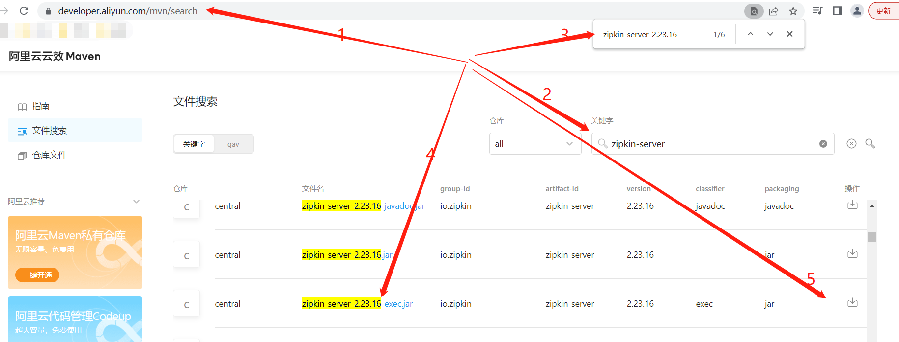

# 日志中心

## 说明

> 本项目已经集成zipkin客户端，这个日志中心提供了zipkin服务端，用来收集客户端的日志。  
> 具体zipkin服务端的用法可以参考见官网：https://zipkin.io/pages/quickstart

## zipkin的jar下载

- 方法一：官网下载，执行：
```jshelllanguage
curl -sSL https://zipkin.io/quickstart.sh | bash -s
```

- 方法二：国内阿里镜像库下载：https://developer.aliyun.com/mvn/search
  

## 启动

> 请务必设置端口为8007，不然其他的微服务配置都要改

- 方法一：直接执行如下命令：
```jshelllanguage
java -jar zipkin-server-2.23.16-exec.jar --server.port=8007
```

- 方法二：执行如下shell脚本：
```jshelllanguage
启动 sh launch.sh start
停止 sh launch.sh stop
重启 sh launch.sh restart
查看状态 sh launch.sh status
```